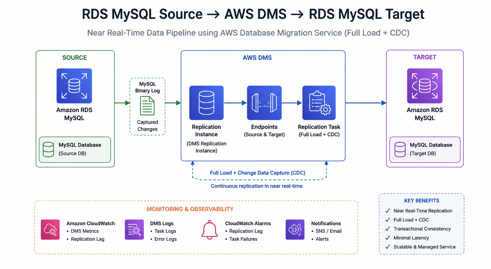

# Near Real-Time Business Metrics Pipeline & Dashboard

Hands-on AWS data engineering project based on the AWS Summit Bangalore 2026 demo:
**Building Near Real-Time Data Pipelines with AWS DMS: Aurora to Aurora (Full Load + CDC)**.

The repo starts with a working AWS DMS full load plus CDC demo, then extends it into a small business metrics platform: synthetic finance data, KPI SQL, dashboard design, operational checks, and a query-catalog based "Ask your dashboard" path.

> Current implementation note: the Summit session title says Aurora to Aurora, but the runnable demo uses RDS MySQL to RDS MySQL. The pivot is documented in [WHY_NOT_AURORA.md](WHY_NOT_AURORA.md). The DMS CDC mechanics are the same for the teaching goal: MySQL binlog capture, full load, live change replication, lag measurement, and transaction consistency.

## What This Demonstrates

- **CDC foundation**: AWS DMS runs a `full-load-and-cdc` task from a source RDS MySQL database.
- **Near real-time behavior**: live writes are generated while full load is running and then measured on the target.
- **Business metrics**: synthetic finance/product data for DAU, conversion, funnels, geography, devices, and payment success.
- **Teaching material**: runbooks, diagrams, workshop flow, and article drafts.
- **Operations**: teardown, replication lag checks, reconciliation queries, schema drift notes, and cost guidance.
- **BI and query layer**: QuickSight dashboard design, Amazon Q topic notes, a local catalog-backed question runner, and an optional OpenAI-powered operations brief.

## Architecture



### Current runnable demo

This architecture is the original AWS Summit demo foundation that the broader project builds on.

```text
RDS MySQL source
  -> AWS DMS full load + CDC
  -> RDS MySQL target
  -> SQL checks for lag, row counts, and transaction consistency
```

### Extended analytics architecture

```text
RDS MySQL source
  -> AWS DMS CDC
  -> S3 raw layer
  -> Python / AWS Glue transformations
  -> Analytics layer: RDS MySQL, Athena, or Redshift
  -> Dashboard: Streamlit or Amazon QuickSight
  -> Query layer: Amazon Q in QuickSight or local query catalog
```

See [docs/architecture.md](docs/architecture.md) for the incremental build plan and diagrams.

## Published Article

The original AWS Summit technical walkthrough is published on AWS Builder:

[Building Near Real-Time Data Pipelines with AWS DMS: Full Load + CDC](https://builder.aws.com/content/3D1dYOYynMHfhqiIRoEYV89LgSH/building-near-real-time-data-pipelines-with-aws-dms-full-load-cdc)

## Videos

- Original AWS Summit session demo: [Watch on YouTube](https://youtu.be/YDKte_7OkqE)
- Full project walkthrough: coming in a separate follow-up video

## Built With Codex

This repo was extended from the original Summit demo into a fuller developer-facing project with Codex: schema design, scripts, dashboards, CloudFormation, debugging, documentation, and recording flow. The build notes are documented in [docs/codex-build-story.md](docs/codex-build-story.md).

## OpenAI-Native Extension

The optional AI Brief feature uses the OpenAI API over a bounded KPI snapshot to generate a structured health summary, risks, and next actions. It is available through `ai/openai_ops_brief.py` and the Streamlit `AI Brief` tab. See [docs/openai-ops-brief-guide.md](docs/openai-ops-brief-guide.md).

## Business Scenario

The expanded schema uses synthetic finance-domain product data:

- customers and accounts
- merchants
- transactions and payments
- login, click, purchase, and payment events
- device metadata
- region and city metadata
- event timestamps designed for near real-time simulation

No real customer or production data is used. The data only needs to be realistic enough for demos, workshops, and screenshots.

## KPIs

The dashboard and tutorial content focus on:

- Daily Active Users
- conversion rate
- payment success rate
- funnel analysis
- time-series trends
- geographic segmentation
- device and user-segment filtering

Definitions live in [docs/kpi-definitions.md](docs/kpi-definitions.md), with starter SQL in [analytics/queries](analytics/queries).

## Repository Structure

```text
cloudformation/
  dms-demo.yaml              # current runnable AWS DMS stack

scripts/
  00-preflight.ps1           # Windows local tool and endpoint checks
  deploy.sh                  # create stack
  start-task.sh              # start DMS full-load-and-cdc task
  status.sh                  # task status and stats
  teardown.sh                # stop task and delete stack
  00-rds-context.sql         # prove source binlog prerequisites
  01-seed-source.sql         # seed current demo schema
  02-concurrent-writes.sh    # live writes during full load
  03-measure-lag.sh          # end-to-end target lag
  04-transaction-demo.sql    # multi-table transaction
  05-verify-target.sql       # transaction verification
  06-cdc-latency-metric.sh   # CloudWatch CDCLatencyTarget
  10-seed-finance-source.sql  # portfolio finance/product seed data
  11-generate-live-finance-events.sh
                              # live transactions, payments, and user events
  12-run-kpis.sh              # run KPI SQL against target
  13-measure-finance-lag.sh   # finance schema CDC lag watcher

docs/
  architecture.md            # current and target architecture
  diagrams.md                # Mermaid diagrams for GitHub rendering
  data-model.md              # synthetic finance/product schema
  kpi-definitions.md         # metric formulas and grain
  demo-storyline.md          # 3-5 minute portfolio demo
  portfolio-demo-runbook.md  # runnable portfolio demo flow
  workshop-flow.md           # workshop modules
  content-plan.md            # blog, video, and LinkedIn ideas
  observability.md           # freshness, lag, reconciliation, drift
  cost-guide.md              # free-tier-friendly operating notes
  live-validation-checklist.md
                              # end-to-end AWS validation checklist
  quicksight-dashboard-guide.md
                              # optional AWS-native dashboard path
  quicksight-cloudformation-guide.md
                              # optional QuickSight CFN assets and teardown
  natural-language-query-guide.md
                              # Amazon Q / local NLQ design
  ask-dashboard-guide.md      # runnable local natural-language KPI CLI
  streamlit-dashboard-guide.md
                              # browser dashboard with Ask tab
  openai-ops-brief-guide.md   # optional OpenAI-powered summary path
  codex-build-story.md        # how Codex was used to evolve the project
  github-publishing-checklist.md
                              # secret-safety checklist before publishing

data/
  synthetic-schema.sql        # draft portfolio source schema

analytics/
  queries/                   # starter KPI SQL

ai/
  ask_dashboard.py            # local KPI question runner
  query_catalog.yaml         # safe KPI query catalog for "Ask your dashboard"
  prompt_templates.md        # optional summary prompt templates

dashboard/
  app.py                     # Streamlit metrics dashboard
  db.py                      # database connection helpers

quicksight/
  dashboard-spec.md           # dashboard sheets, visuals, filters
  topic-design.md             # Amazon Q topic vocabulary and synonyms
  sample-questions.md         # demo-ready business questions
  screenshots/                # add dashboard screenshots after build

slides/
  outline.md                 # original Summit speaker notes

articles/
  01-from-dms-demo-to-business-metrics-platform.md
  02-full-load-vs-cdc.md
```

## Quick Start: Current DMS Demo

Prerequisites:

- AWS CLI v2
- `mysql` client
- an AWS profile with permission to create RDS, DMS, IAM, EC2 networking, and CloudWatch resources
- a region with RDS MySQL and AWS DMS support; the scripts default to `us-east-1`

Deploy:

```bash
export AWS_PROFILE=summit-demo
export AWS_REGION=us-east-1
export DB_PASSWORD='<set-a-strong-demo-password>'

./scripts/deploy.sh
```

Run the live demo:

```bash
export SRC_HOST=$(aws cloudformation describe-stacks --profile "$AWS_PROFILE" --region "$AWS_REGION" \
  --stack-name dms-demo \
  --query "Stacks[0].Outputs[?OutputKey=='SourceEndpointAddress'].OutputValue" --output text)

mysql -h "$SRC_HOST" -u admin -p"$DB_PASSWORD" demo < scripts/00-rds-context.sql
mysql -h "$SRC_HOST" -u admin -p"$DB_PASSWORD" demo < scripts/01-seed-source.sql
./scripts/start-task.sh
./scripts/02-concurrent-writes.sh
./scripts/03-measure-lag.sh
```

For the exact stage-ready flow, use [DEMO_RUNBOOK.md](DEMO_RUNBOOK.md).

For the broader portfolio demo, use [docs/portfolio-demo-runbook.md](docs/portfolio-demo-runbook.md):

```bash
mysql -h "$SRC_HOST" -u admin -p"$DB_PASSWORD" demo < scripts/10-seed-finance-source.sql
./scripts/start-task.sh
# In another terminal:
./scripts/11-generate-live-finance-events.sh
# In another terminal after full load completes:
./scripts/13-measure-finance-lag.sh
./scripts/12-run-kpis.sh
```

Teardown:

```bash
./scripts/teardown.sh
```

## Build Roadmap

### MVP

- Keep the existing DMS full load plus CDC stack.
- Replace the simple demo data with synthetic finance/product analytics tables.
- Add KPI SQL for DAU, conversion, payment success, funnel, geography, and device cuts.
- Add a lightweight dashboard path using RDS MySQL plus Streamlit or saved QuickSight screenshots.
- Document the demo as a portfolio walkthrough.

### Intermediate

- Add an S3 raw layer as an additional DMS target path.
- Add Python or AWS Glue transformations from raw to curated tables.
- Add fact and dimension models.
- Add reconciliation checks and freshness metrics.
- Add QuickSight as an optional dashboard path.

### Advanced Optional

- Add Redshift Serverless or Athena as the analytics serving layer.
- Add Step Functions orchestration.
- Add data quality checks using Great Expectations or lightweight SQL checks.
- Add schema drift detection.
- Add QuickSight dashboards and Amazon Q questions.
- Add the local "Ask your dashboard" query runner.

## How This Helps

This repo is meant to be useful in three settings: a live demo, a workshop, and a public portfolio. The important pieces are:

- reproducible infrastructure
- strong demo narrative
- clear diagrams
- workshop modules
- troubleshooting and cost notes
- business-focused KPIs
- a question runner that stays tied to approved KPI SQL

Use [docs/demo-storyline.md](docs/demo-storyline.md), [docs/workshop-flow.md](docs/workshop-flow.md), and [docs/content-plan.md](docs/content-plan.md) to shape talks, blog posts, videos, and job-application portfolio material.

Architecture diagrams are in [docs/diagrams.md](docs/diagrams.md). Article drafts are in [articles](articles).

For the optional AWS-native dashboard path, see [docs/quicksight-dashboard-guide.md](docs/quicksight-dashboard-guide.md), [quicksight/dashboard-spec.md](quicksight/dashboard-spec.md), and [docs/natural-language-query-guide.md](docs/natural-language-query-guide.md).

For CloudFormation-managed QuickSight dashboard, datasets, data source, security group ingress, and topic creation, see [docs/quicksight-cloudformation-guide.md](docs/quicksight-cloudformation-guide.md):

```bash
./scripts/deploy-quicksight.sh
```

For the local natural-language query path, see [docs/ask-dashboard-guide.md](docs/ask-dashboard-guide.md):

```bash
python ai/ask_dashboard.py "How fresh is the dashboard?" --dry-run
```

For the browser dashboard, see [docs/streamlit-dashboard-guide.md](docs/streamlit-dashboard-guide.md):

```powershell
python -m streamlit run dashboard/app.py
```

The Streamlit dashboard includes an **Ask Your Dashboard** tab. It supports
natural-language-style questions by matching them to approved KPI queries in
`ai/query_catalog.yaml`; it does not generate unrestricted SQL.

## Cost Guard

This repo creates billable AWS resources. Keep demos short, use small instances, and run teardown immediately after use. Treat QuickSight, Redshift, Glue, and always-on RDS/DMS resources as optional extensions unless you explicitly want to spend on them.

See [docs/cost-guide.md](docs/cost-guide.md).

## Security

Do not commit AWS credentials, database passwords, `.env` files, or generated CloudFormation outputs. Use `.env.example` as a template and keep real values in your local shell, AWS profile, or a secrets manager.

Before publishing, run:

```bash
rg -n "AKIA|ASIA|aws_secret_access_key|aws_access_key_id|aws_session_token|AWS_ACCESS_KEY|AWS_SECRET|DB_PASSWORD=|password='|rds.amazonaws.com" .
```

See [docs/github-publishing-checklist.md](docs/github-publishing-checklist.md).
