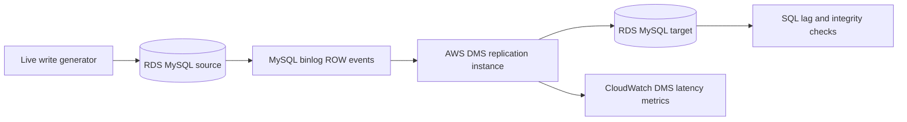
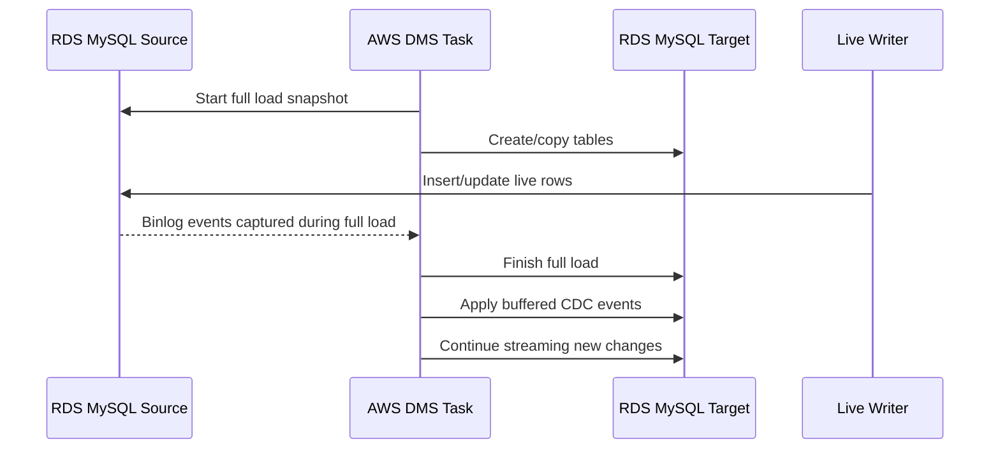
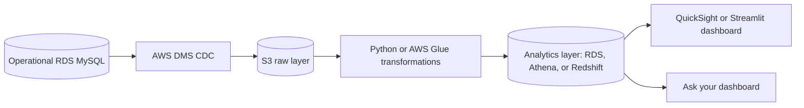
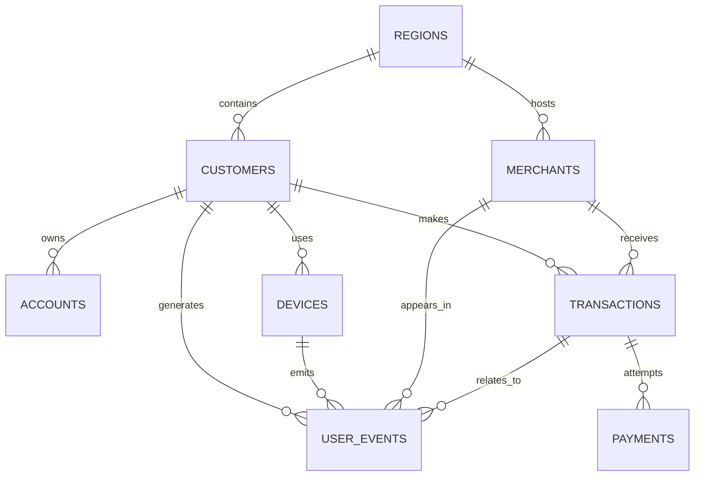
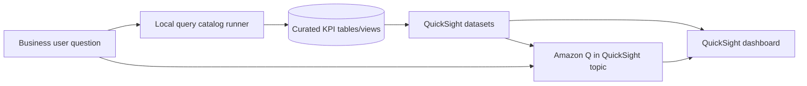
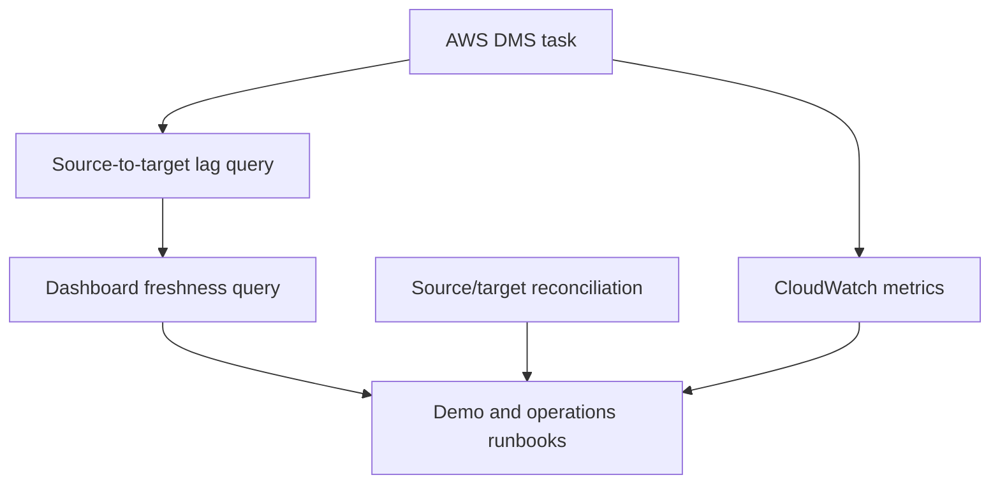

# Architecture Diagrams

These diagrams are written in Mermaid so they render directly on GitHub.

## Current Runnable DMS Demo

## Full Load Plus CDC

## Portfolio Analytics Platform

## Finance/Product Data Model

## QuickSight and Natural Language Path

## Observability Loop

